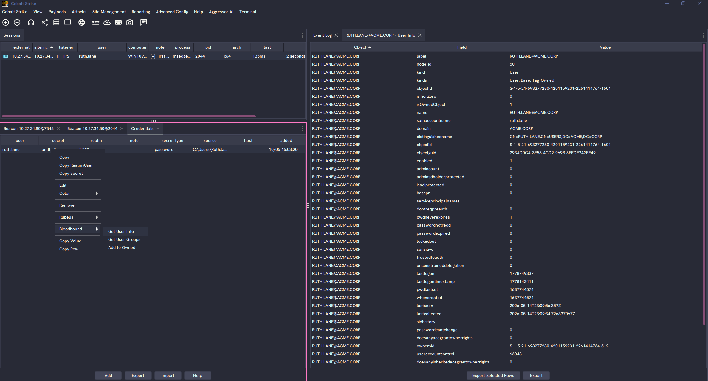
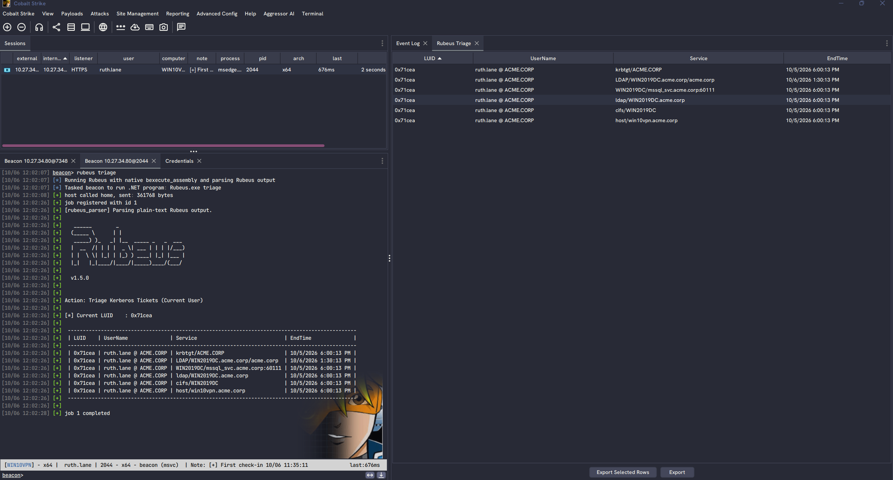
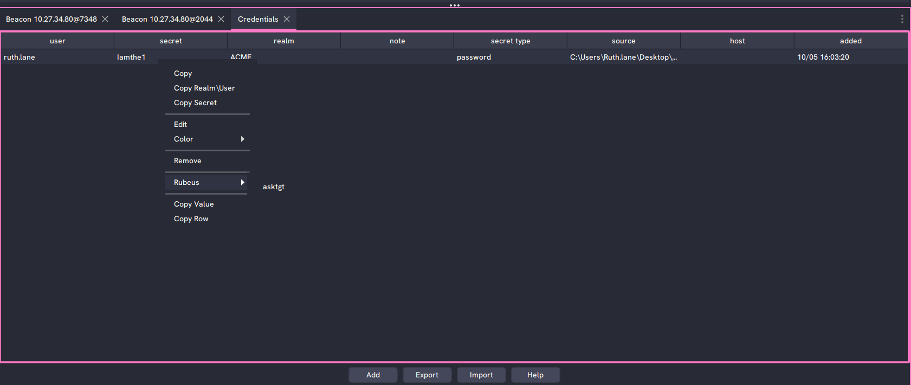
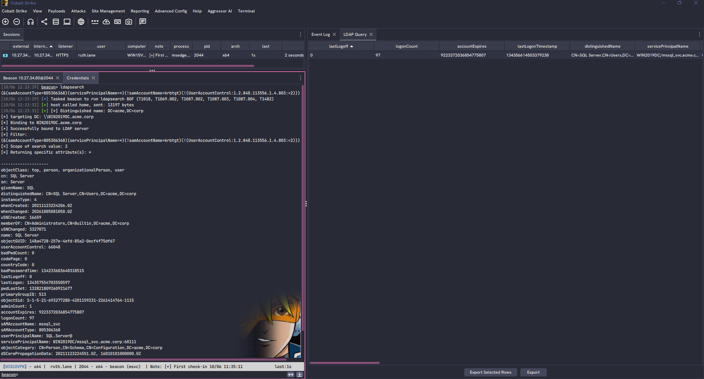

# Red Team Context

A collection of Cobalt Strike Aggressor Script examples that bring tool output and external context into the client through custom tables, right-click menus, and credential-store integration.

> [!NOTE]
> This project is under active development and may introduce breaking changes.

| Script | Description | Documentation |
| --- | --- | --- |
| `bloodhound.cna` | Connects to BloodHound CE/Enterprise for user, computer, group, and ADCS lookups, plus Owned marking from Cobalt Strike menus. | [BloodHound example](bloodhound-example/README.md) |
| `rubeus_extension.cna` | Adds credential-row actions to request or renew tickets with Rubeus. | [Rubeus example](rubeus-example/README.md#credential-popup-actions) |
| `SA.cna` | Extends TrustedSec's situational-awareness script with LDAP and ADCS result tables and a right-click LDAP follow-up action. | [TrustedSec SA example](TrustedSec-CS-Situational-Awareness-BOF/Readme.md) |

Follow each example's README for configuration, dependencies, and loading instructions. Custom tables require Cobalt Strike 4.13 or later. Rubeus and the compiled TrustedSec BOFs must be supplied separately. Loading the BloodHound example also adds lookup actions to the SA tables.

## Screenshots

### BloodHound

*The credential-row BloodHound menu opens user properties in a dedicated User Info table.*

### Rubeus

*Rubeus triage output appears in a table showing logon IDs, users, services, and ticket expiration times alongside the Beacon console output.*

*The Rubeus context menu provides an `asktgt` action to request a Kerberos ticket using the selected credential.*

### TrustedSec SA

*LDAP search results appear in an LDAP Query table with returned attributes as columns, while the full output remains in the Beacon console.*
